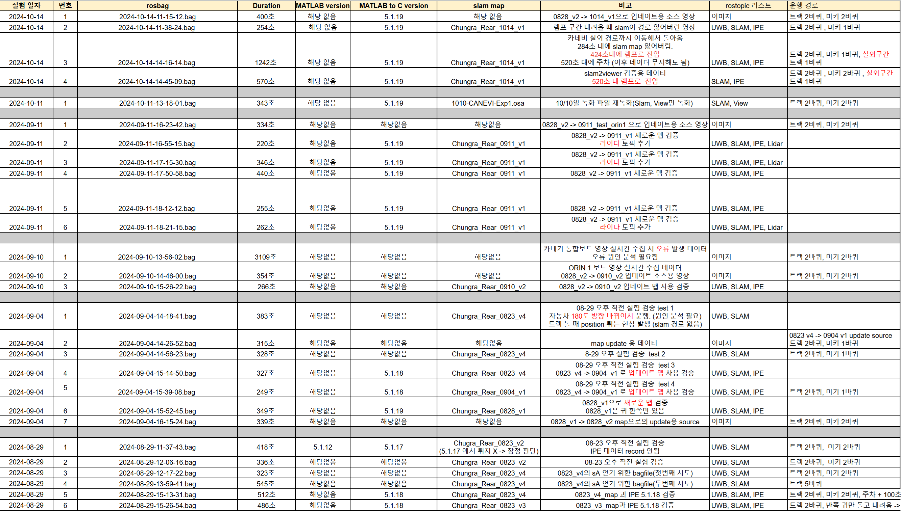

-K-LocalizationFieldTest
===========================
본 리파지토리는 KETI 실내 위치 추정 시스템(IPE) 실증을 위한 실험 데이터 및 데이터 분석용 소스파일 저장소이다. 실증을 위한 테스트 베드는 인천 청라 로봇타워 건물 지하주차장과 판교 글로벌 R&D 센터 지하주차장이다. 하위폴더인 ChungraRW와 GlobalRnD는 각각 청라 로봇타워와 판교 글로벌센터에서의 실험 데이터를 저장한 폴더이다. 각 구역 폴더마다 그 하위폴더인 bagfiles에는 ROS 기반 토픽 데이터 파일이 저장되어 있다. 깃허브 용량 제한으로 10MB 미만의 파일만 업로드하였으며, 나머지 파일은 서버에 저장되어 있다.  

## 실험 결과 정리 엑셀 파일 링크 
[파일] (https://docs.google.com/spreadsheets/d/1THzQ-f1JkZ9Kj0yhmzJDvz4ZVeGnWTi1LahA1Fd2BCU/edit?gid=505437899#gid=505437899)

 